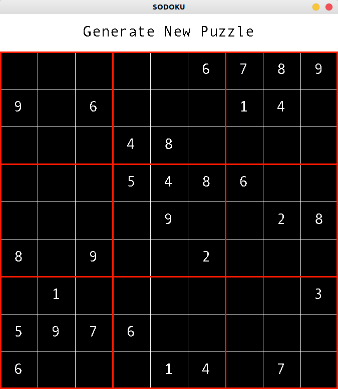
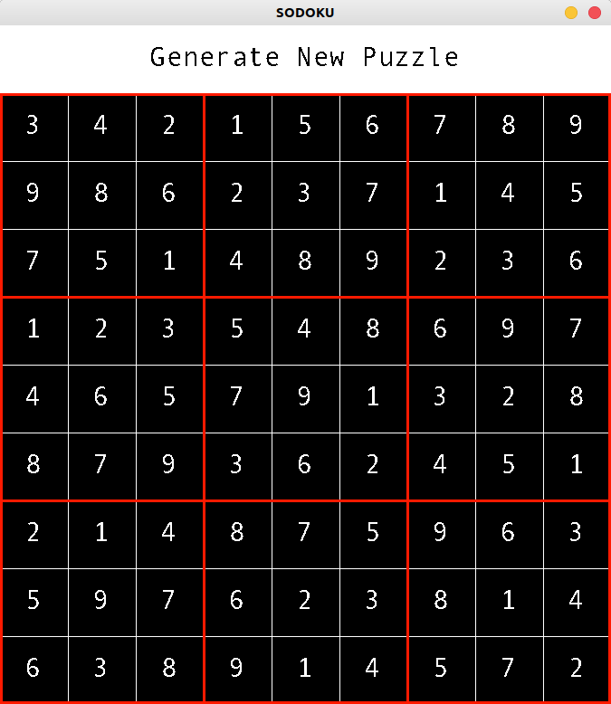

# SUDOKU SOLVER
---HOW TO ---

0. Install Python 3

0.5. Update pip to the lastest version:
> pip3 install --upgrade pip
1. Install the required modules using the lastest pip, then run this at the root folder /Sudoku:
> pip3 install -r requirements.txt
2. Run main.py

------x-------

  **GENERATE** a new puzzle:

------x-------

**RIGHT CLICK** TO SOLVE:

